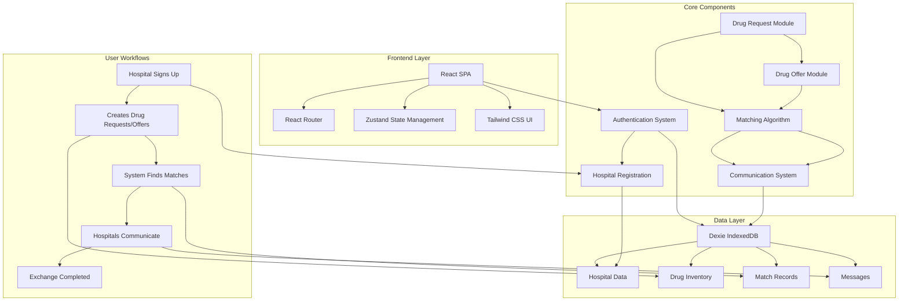

# MedExchange - Hospital Drug Exchange Platform

[](https://opensource.org/licenses/MIT)
[](https://reactjs.org/)
[](https://www.typescriptlang.org/)
[](https://vitejs.dev/)

A modern, secure platform enabling hospitals to exchange medications efficiently, reducing pharmaceutical waste and ensuring critical drugs reach patients in need.

## 🏥 Overview

MedExchange is a comprehensive hospital drug exchange platform that connects healthcare facilities to optimize medication inventory management. The platform allows hospitals to request needed medications and offer surplus inventory, creating an efficient marketplace that reduces waste while ensuring patient care continuity.

## ✨ Key Features

### 🔐 **Secure Hospital Registration**
- Verified hospital account creation with license validation
- Comprehensive hospital profile management
- Representative contact information tracking

### 💊 **Smart Medication Management**
- **Request Medications**: Submit detailed drug requests with DIN numbers, dosage requirements, and delivery preferences
- **Offer Surplus**: List available medications with expiry dates and delivery capabilities
- **CSV Import**: Bulk upload medication lists via CSV files for efficient data entry

### 🎯 **Intelligent Matching System**
- Advanced algorithm matching requests with available supplies
- Geographic proximity-based filtering (5km to 200km radius)
- Medication similarity scoring for optimal matches
- Real-time match quality assessment

### 📊 **Comprehensive Dashboards**
- **Provider Dashboard**: Manage medication offers and view incoming requests
- **Requestor Dashboard**: Track medication requests and browse available supplies
- Distance and status filtering capabilities
- Match quality indicators and hospital details

### 💬 **Integrated Communication**
- Direct messaging between matched hospitals
- Exchange status tracking and updates
- Quick reply templates for common interactions
- Read receipts and message delivery confirmation

### 📋 **Exchange Management**
- Complete transaction tracking from initial match to completion
- Status progression: Pending → Notified → Agreed → Completed
- Delivery coordination and contact sharing
- Invoice and documentation management

## 🏗️ System Architecture



## 🚀 Getting Started

### Prerequisites

- **Node.js** 18.0 or higher
- **npm** or **yarn** package manager
- Modern web browser with ES6+ support

### Installation

1. **Clone the repository**
   ```bash
   git clone https://github.com/billy-enrizky/matchmaking-drugs-v2.git
   cd matchmaking-drugs-v2
   ```

2. **Install dependencies**
   ```bash
   npm install
   ```

3. **Start the development server**
   ```bash
   npm run dev
   ```

4. **Open your browser**
   Navigate to `http://localhost:5173` to access the application

### Build for Production

```bash
npm run build
npm run preview
```

## 📁 Project Structure

```
src/
├── components/           # Reusable UI components
│   ├── AuthCheck.tsx    # Authentication wrapper
│   ├── Button.tsx       # Button component
│   ├── Card.tsx         # Card layout component
│   ├── Input.tsx        # Form input component
│   └── ...
├── layouts/
│   └── AppLayout.tsx    # Main application layout
├── pages/               # Application pages/routes
│   ├── LandingPage.tsx  # Homepage and marketing
│   ├── AccountSetup.tsx # Hospital registration
│   ├── Login.tsx        # User authentication
│   ├── RequestDrugs.tsx # Medication request form
│   ├── ProvideDrugs.tsx # Medication offer form
│   ├── RequestorDashboard.tsx  # Request management
│   ├── ProviderDashboard.tsx   # Offer management
│   ├── Messaging.tsx    # Communication interface
│   └── ...
├── services/
│   └── db.ts           # Database operations (Dexie)
├── stores/
│   └── authStore.ts    # Authentication state (Zustand)
├── types/
│   └── index.ts        # TypeScript type definitions
└── ...
```

## 🛠️ Technology Stack

### **Frontend Framework**
- **React 18.3.1** - Modern UI library with hooks and concurrent features
- **TypeScript 5.5.3** - Type-safe development and enhanced IDE support
- **Vite 5.4.2** - Fast build tool and development server

### **Routing & State Management**
- **React Router DOM 6.22.3** - Client-side routing and navigation
- **Zustand 4.5.1** - Lightweight state management solution

### **Database & Storage**
- **Dexie 4.0.11** - IndexedDB wrapper for client-side data persistence
- **bcryptjs 3.0.2** - Password hashing and security

### **UI & Styling**
- **Tailwind CSS 3.4.1** - Utility-first CSS framework
- **Lucide React 0.344.0** - Beautiful, customizable icons
- **clsx 2.1.0** - Conditional className utilities

### **Form Management**
- **React Hook Form 7.51.0** - Performant forms with minimal re-renders
- **Papa Parse 5.4.1** - CSV parsing for bulk data import

### **Development Tools**
- **ESLint 9.9.1** - Code linting and quality enforcement
- **PostCSS 8.4.35** - CSS processing and optimization

## 🔧 Key Components

### Authentication System
- Secure hospital registration with license verification
- Password encryption using bcryptjs
- Session management with Zustand

### Medication Management
- Support for Drug Identification Numbers (DIN)
- Dosage and expiry date tracking
- CSV bulk import functionality
- Geographic delivery radius configuration

### Matching Algorithm
- Similarity scoring based on drug names and specifications
- Distance-based filtering and sorting
- Real-time match quality assessment
- Multi-criteria optimization

### Communication Platform
- Real-time messaging between hospitals
- Message status tracking (sent, delivered, read)
- Quick reply templates for common scenarios
- Exchange status updates and notifications

## 📈 Features in Detail

### Hospital Registration
- Multi-step registration process
- License number validation
- Complete address and contact information
- Representative details and verification

### Drug Request Management
- Detailed medication specifications
- Delivery location and radius preferences
- Bulk CSV import support
- Request status tracking

### Drug Offer Management
- Inventory listing with expiry dates
- Delivery capability specification
- Match notification system
- Offer status management

### Intelligent Matching
- Geographic proximity algorithms
- Medication similarity scoring
- Real-time match quality indicators
- Filter and sort capabilities

## 🤝 Contributing

We welcome contributions to improve MedExchange! Please follow these steps:

1. **Fork the repository**
2. **Create a feature branch** (`git checkout -b feature/amazing-feature`)
3. **Commit your changes** (`git commit -m 'Add amazing feature'`)
4. **Push to the branch** (`git push origin feature/amazing-feature`)
5. **Open a Pull Request**

### Development Guidelines
- Follow TypeScript best practices
- Maintain consistent code formatting with ESLint
- Write clear, descriptive commit messages
- Ensure responsive design compatibility
- Test functionality across different browsers

## 📄 License

This project is licensed under the MIT License - see the [LICENSE](LICENSE) file for details.

## 🙋‍♂️ Support

For questions, issues, or feature requests:

- **GitHub Issues**: [Create an issue](https://github.com/billy-enrizky/matchmaking-drugs-v2/issues)
- **Project Repository**: [github.com/billy-enrizky/matchmaking-drugs-v2](https://github.com/billy-enrizky/matchmaking-drugs-v2)

## 🎯 Roadmap

- [ ] **Real-time notifications** for new matches and messages
- [ ] **Advanced analytics** dashboard for exchange metrics
- [ ] **Mobile application** for iOS and Android
- [ ] **API integration** with hospital management systems
- [ ] **Regulatory compliance** features for different jurisdictions
- [ ] **Multi-language support** for international use

---

**MedExchange** - Connecting hospitals, optimizing resources, saving lives. 🏥💊
